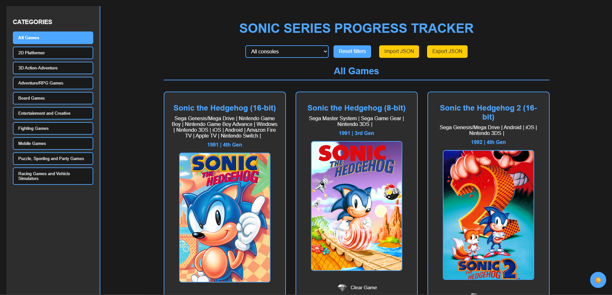
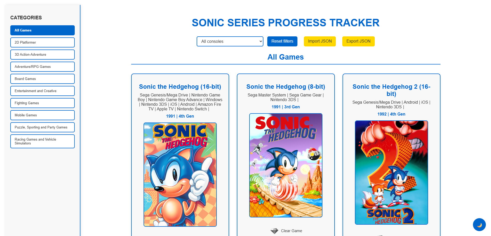
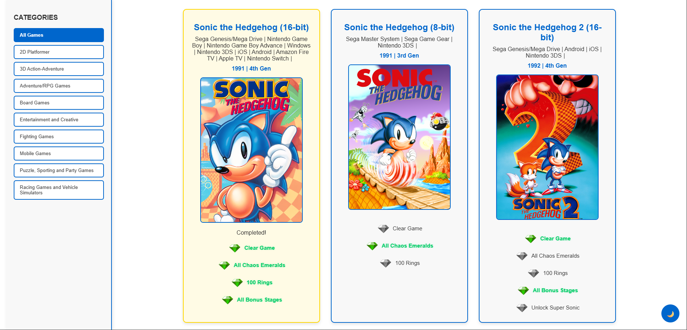
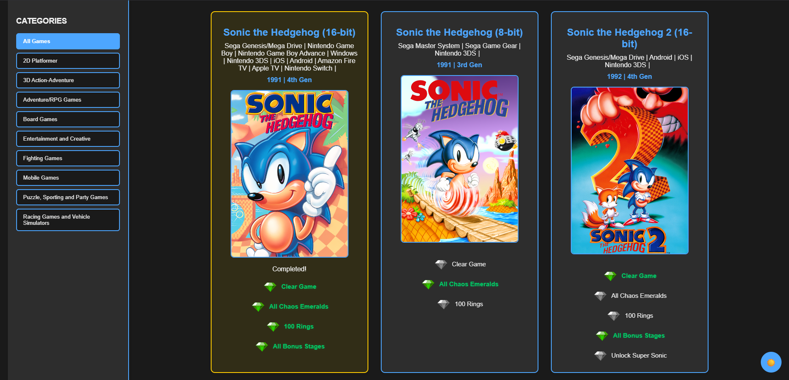

# 🚀 Games Series Progress Tracker 

A progress tracker that saves locally to complete all games from different game series. Mark your achievements and share your progress with the community.

## 🎮 Features.
- Track completion per game
- Special Achievements (All Chaos Emeralds, No Death Run, etc.)
- Filters by console and generation.
- Dark/Light mode
- Different series of games to complete
- Export and import progress using a JSON file

## 🛠️ How to Use
1. Visit [the tracker page](https://tonymontania.github.io/games-tracker/)
2. Check the games you have completed
3. Your progress is automatically saved with localStorage.

## 📦 Games included
- Sonic Series: Completed!
- Mario Series: In Progress...
- Zelda Series: In Progress...
- Kirby Series: In Progress...
- ...

## 🎨 Screenshoots
 
 

## 🛠️ Technologies

## 🤝 Contribute
Contributions are welcome! Follow these steps:
1. Make fork of the project.
2. Create your branch (`git checkout -b feature/new-function`)
3. Commit your changes (`git commit -m ‘Add new feature’`)
4. Push to the branch (`git push origin feature/new-function`)
5. Open a Pull Request

## 📄 License
This project is licensed under the [MIT](LICENSE).

---

⭐ Do you like the project? Give it a star on GitHub to support its development.
